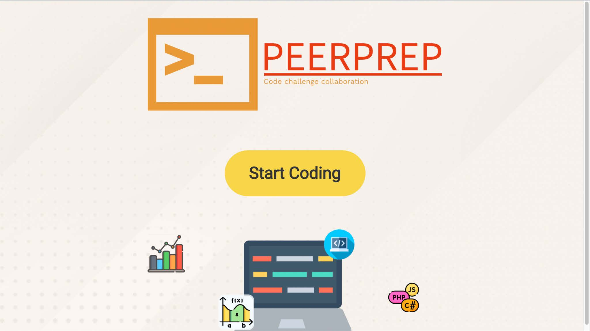

# CS3219-AY22-23-Project - PeerPrep (Team 48)

App is deployed at https://cs3219-48-peerprep.herokuapp.com/.

## Introduction

PeerPrep is a web application that helps students prepare for whiteboard style technical interviews. PeerPrep provides a peer learning platform where students can match up with peers depending on difficulty in order to practice technical interview questions. Peerprep comes with a collaborative editor, chatbox as well as a question bank that users can access to see all the available questions.

## How to use Peerprep?

### Prerequisite

Due to the limitation of heroku free tier, please spin up the respective servers before accessing the app on the following link:
https://cs3219-48-peerprep.herokuapp.com/  
Frontend should show the landing page as per instructions below.

https://cs3219-48-user-service.herokuapp.com/api/user  
User service should display “Hello World from user-service” if successfully loaded.

https://cs3219-48-question-service.herokuapp.com/api/question  
Question service should display a JSON object with “data” as the first field.

https://cs3219-48-matching-service.herokuapp.com/  
Matching service should display “Hello World from matching-service” when successfully loaded.

https://cs3219-48-collab-service.herokuapp.com/  
Collab service should display “okay” when successfully loaded.

https://cs3219-48-communicationservice.herokuapp.com/  
Communication service should display “Hello World from communication-service” if successfully loaded.

<b>Note: </b> You might need to refresh the page if heroku displays an error the first time.

### Instructions

1. From the landing page, click on "Start Coding".
   

2. On the login page, if you do not have an account, click on “Create new account”.
   

3. You will be brought to the register page. Enter the username, password and email that you would like to use, then click “Sign up”.
   

4. You should see a pop up stating a successful creation. If not, refresh the page and try again. Click “log in”. This will redirect you back to the login page.
   

5. Enter your username and password and click the “Log in” button.
   

6. Once you are in, you should see the following matching page. Feel free to explore the various buttons but for now let’s go through how to queue for a match.
   

7. Select a difficulty. Here we selected “hard”. Then click the “Start Coding” button.
   

8. The match will start and a countdown from the 30s will begin. If you have a friend, get him to queue up as well for the “hard”.
   

9. Now you have successfully matched with your friend and can begin your interview preparation. The editor box on the side allows for you and your friend to code in a collaborative manner.
   

10. However, if after 30s you still have yet to be matched you will be presented with 2 choices. EIther change the difficulty you are queueing for or queue again.
    

### Find out more?

Read our documentation [here](./documentation/48-FinalReport.pdf)!
